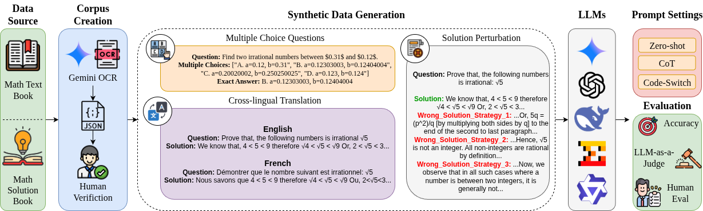

# MathMist: A Parallel Multilingual Benchmark Dataset for Mathematical Problem Solving and Reasoning

## Accepted for Publication in Findings of EACL 2026 🎉

> 🌍 **TL;DR**: MathMist introduces a 21K-sample multilingual benchmark spanning seven languages that enables code-switch CoT and perturbation reasoning analysis in mathematical word problems, revealing how model scale, alignment, and multilingual pretraining jointly shape reasoning performance.

_**Abstract:** Mathematical reasoning remains one of the most challenging domains for large language models (LLMs), requiring not only linguistic understanding but also structured logical deduction and numerical precision. While recent LLMs demonstrate strong general-purpose reasoning abilities, their mathematical competence across diverse languages remains underexplored. Existing benchmarks primarily focus on English or a narrow subset of high-resource languages, leaving significant gaps in assessing multilingual and cross-lingual mathematical reasoning. To address this, we introduce MathMist, a parallel multilingual benchmark for mathematical problem solving and reasoning. MathMist encompasses over 21K aligned question–answer pairs across seven languages, representing a balanced coverage of high-, medium-, and low-resource linguistic settings. The dataset captures linguistic variety, multiple types of problem settings, and solution synthesizing capabilities. We systematically evaluate a diverse suite of models, including open-source small and medium LLMs, proprietary systems, and multilingual-reasoning-focused models, under zero-shot, chain-of-thought (CoT), and code-switched CoT prompting paradigms. Our results reveal persistent deficiencies in LLMs’ ability to perform consistent and interpretable mathematical reasoning across languages, with pronounced degradation in low-resource settings._

  

Fig: Overview of MathMist data creation and evaluation pipeline. **(Left)** Data Sourcing and corpus creation uses Gemini OCR on textbooks, stores data to JSONL, and applies human verification. **(Center)** Synthetic data generation encompasses Multiple Choice Question (MCQ) generation, Cross-Lingual Translation, and Solution Perturbation. **(Right)** The evaluation process tests various LLMs under different prompt settings.

## Cite
<pre>
@article{sobhani2025mathmist,
  title={MathMist: A Parallel Multilingual Benchmark Dataset for Mathematical Problem Solving and Reasoning},
  author={Sobhani, Mahbub E and Sayeedi, Md Faiyaz Abdullah and Mohiuddin, Tasnim and Islam, Md Mofijul and Shatabda, Swakkhar},
  journal={arXiv preprint arXiv:2510.14305},
  year={2025}
}
</pre>

<!-- ### 🔖 Tags / Keywords

🧮 **Mathematical Question Answering**  
📐 **Mathematical Reasoning**  
🌀 **Perturbed Reasoning**  
💬 **Code-Switched Reasoning**  
❓ **Multiple Choice Question**  
🌐 **Cross-Lingual Reasoning**  
📚 **National Curriculum and Textbook Board (NCTB) Math Dataset**  
🚀 **Zero-Shot**  
🧠 **Chain of Thought (CoT)**  
🌍 **Multilingual**  
🔤 **Indo-European Languages**  
❄️ **Uralic Languages**  
🧩 **Turkic Languages**  
📝 **Indo-Aryan Languages** -->
